<div align="center">
  
</div>

<div align="center">


[](https://flutter.dev)
[](https://firebase.google.com)
[](https://www.bitgo.com)
[](https://www.rust-lang.org)
[](https://github.com/iden3/circom)
[](https://fileverse.io)
[](https://nodejs.org)

**STAMPED** is a mobile-first platform for **tamper-proof, cryptographically attested photo documentation** - merging ZK proofs, TEE hardware attestation, blockchain records, steganographic image embedding, and decentralized storage into a single enterprise-grade workflow tool.

</div>

---

## Table of Contents

1. [Market Research & Fraud Problem](#-market-research--the-fraud-problem)
2. [What is STAMPED?](#-what-is-stamped)
3. [System Architecture Overview](#️-system-architecture-overview)
4. [Security Layers Explained](#-security-layers-explained)
5. [TEE, TrustZone & Hardware Attestation](#-tee-trustzone--hardware-attestation)
6. [Image Embedding Algorithms](#-image-embedding-algorithms)
7. [ZK Proof Layer](#-zk-proof-layer-circom--groth16--mopro)
8. [Firebase & Firestore Schema](#-firebase--firestore-schema)  
9. [BitGo Backend Architecture](#-bitgo-tss-mpc-backend)
10. [Flutter Frontend Architecture](#-flutter-frontend-architecture)
11. [Fileverse Decentralized Docs](#-fileverse-decentralized-document-layer)
12. [Data & Proof Flow Sequence](#-data--proof-flow-end-to-end)
13. [Market Components & Competition](#-market-components--competitive-landscape)
14. [API Reference](#-api-reference)
15. [Setup & Installation](#-setup--installation)

---

## Market Research — The Fraud Problem

### Scale of Visual Evidence Tampering

The industry STAMPED addresses is vast and growing rapidly. Digital photo manipulation, fraudulent evidence submission, and falsified field reporting cost enterprises and governments **billions annually**.

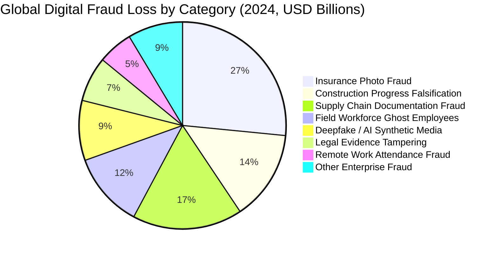

| Category | Annual Loss (USD) | YoY Growth | Primary Victims |
|---|---|---|---|
| Insurance Photo Fraud | $34B | +18% | Insurers, Re-insurers |
| Construction Progress Fraud | $18B | +22% | Contractors, Governments |
| Supply Chain Doc Fraud | $22B | +31% | Retailers, Logistics |
| Ghost Employee Workforce | $15B | +14% | Enterprises, NGOs |
| Deepfake Synthetic Media | $12B | +67% | Courts, Media, Finance |
| Legal Evidence Tampering | $9B | +11% | Legal, Public Sector |
| Remote Work Fraud | $7B | +44% | Tech Enterprises |

> **Source estimates aggregated from**: Coalition Against Insurance Fraud (2024), Gartner Supply Chain Report (2024), IBM Security X-Force (2024), PwC Global Economic Crime Survey (2024).

### Detection Gap Analysis

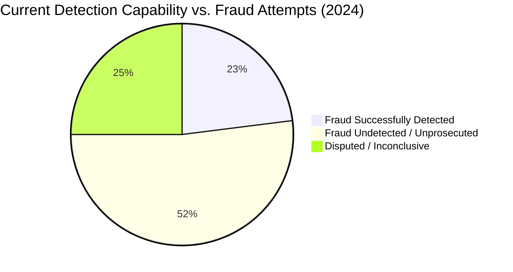

> **Only 23% of digital visual fraud is caught** with current metadata-stripping, EXIF-inspection, and manual review tools. STAMPED targets the 77% gap with hardware-level cryptographic proof.

### Deepfake & AI Manipulation Growth

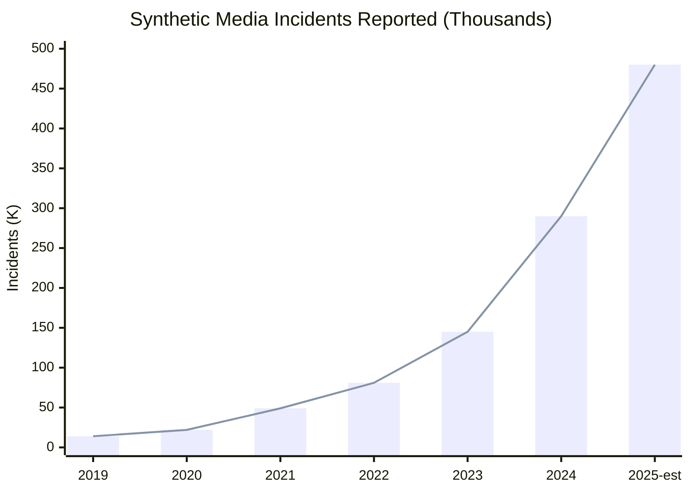

### Addressable Market

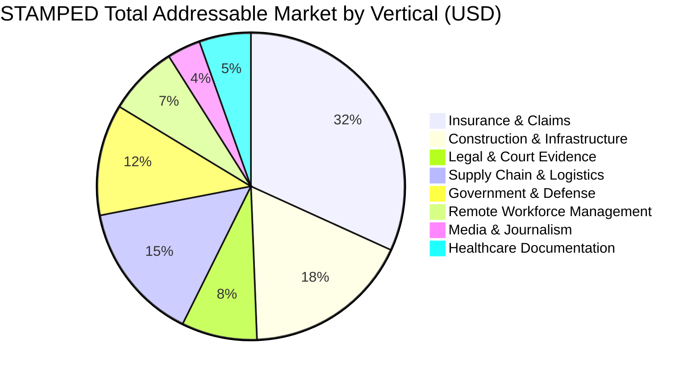

**Total Addressable Market (TAM): ~$1.2 Trillion**  
**Serviceable Addressable Market (SAM): ~$85 Billion**  
**Serviceable Obtainable Market (SOM, 5yr): ~$2.1 Billion**

---

## What is STAMPED?

STAMPED is a **multi-layer truth protocol for photographs**. When a user captures an image with STAMPED:

1. **Hardware** (TrustZone/TEE) signs the capture event inside the secure enclave before the pixels leave the sensor
2. **Cryptographic hash** (SHA-256) of raw pixels is computed
3. **Image steganography** (DCT/DWT watermark + SuperPoint keypoint encoding) embeds invisible proof metadata directly into pixels
4. **ZK Proof** (Groth16/Circom) proves: "This hash was produced from this camera at this time" — without revealing private sensor data
5. **Blockchain transaction** anchors the proof on Ethereum Holesky Testnet via BitGo MPC TSS
6. **Decentralized document** (Fileverse dDoc) stores the full forensic report permanently on a peer-to-peer network
7. **Firebase** stores verified metadata so any third party can **replay and verify** the proof chain

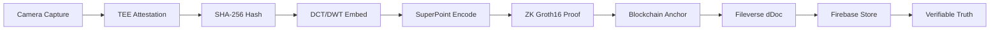

---

## System Architecture Overview

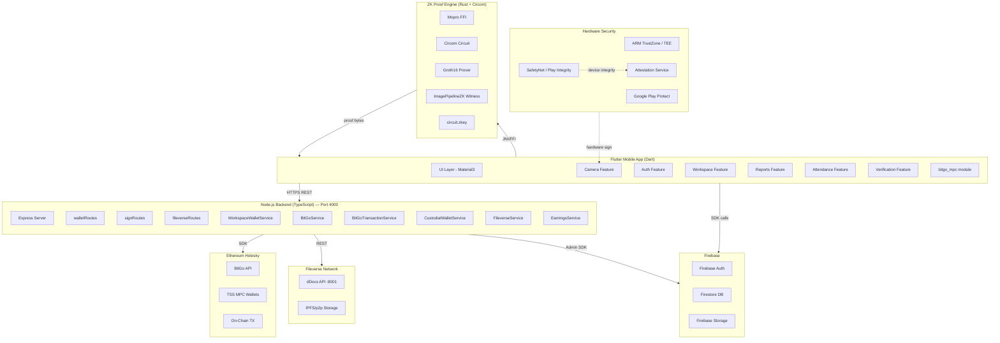

---

## Security Layers Explained

STAMPED implements **7 concentric security layers**. Each layer independently validates the authenticity of a captured image. An attacker would need to break ALL layers simultaneously — a computationally infeasible feat.

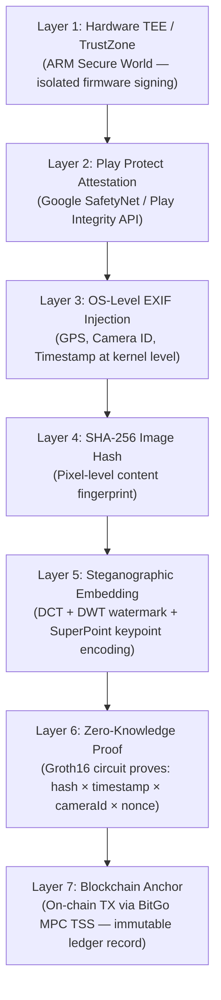

| Layer | Technology | Tamper Evidence | Bypass Difficulty |
|---|---|---|---|
| 1 | ARM TrustZone TEE | Hardware reset required | Catastrophic |
| 2 | Play Protect / SafetyNet | Device fails integrity check | Extreme |
| 3 | OS EXIF injection | Metadata mismatch detected | Very High |
| 4 | SHA-256 hash | Hash collision detected | Astronomically High |
| 5 | DCT/DWT + SuperPoint embed | Statistical anomaly detected | Very High |
| 6 | ZK Groth16 proof | Proof verification fails | Computationally Infeasible |
| 7 | On-chain anchor | Blockchain immutability | Practically Impossible |

---

## TEE, TrustZone & Hardware Attestation

### ARM TrustZone Architecture

Every modern Android/iOS device contains a **hardware-isolated Secure World** (ARM TrustZone). STAMPED leverages this to sign the camera capture event *before* the image is ever accessible to the Normal World OS.

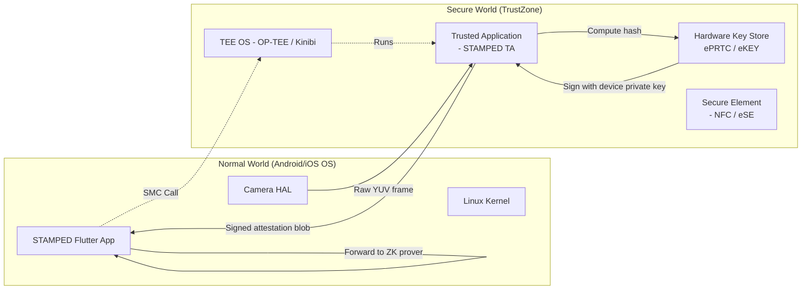

### Google Play Protect & Play Integrity API

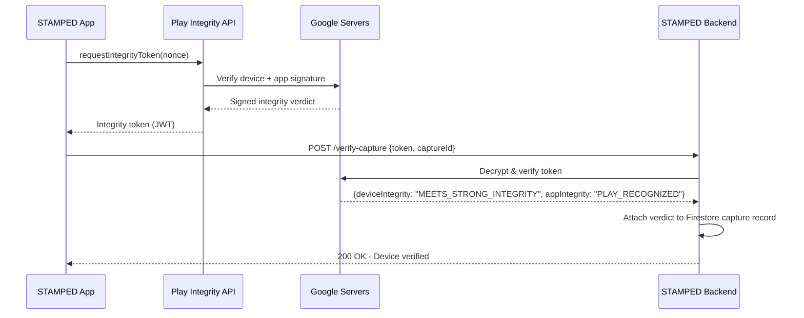

**Play Integrity Verdict Labels STAMPED Checks:**

| Verdict Field | Required Value | Meaning |
|---|---|---|
| `MEETS_DEVICE_INTEGRITY` | Required | Passes Android CTS, no custom ROM |
| `MEETS_STRONG_INTEGRITY` | Required | Hardware-backed keystore present |
| `APP_INTEGRITY` | `PLAY_RECOGNIZED` | App was distributed via Play Store unmodified |
| `ACCOUNT_DETAILS` | `LICENSED` | User is licensed (not sideloaded) |

### TrustOS / Attestation Service Integration

STAMPED is architected to interoperate with **TrustOS** — an enterprise TEE management layer that abstracts over manufacturer (Qualcomm QTEE, Samsung Knox, ARM OP-TEE) differences:

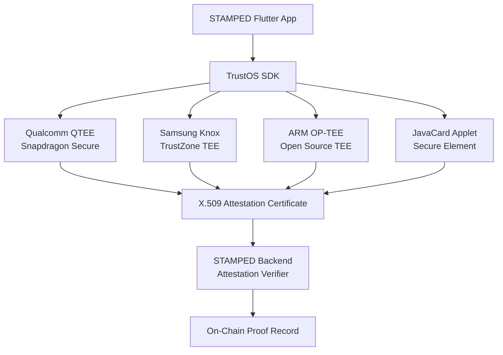

---

## Image Embedding Algorithms

STAMPED uses **three complementary steganographic and feature-encoding algorithms** to embed irremovable, verifiable proof markers directly into pixel data.

### 1. DCT (Discrete Cosine Transform) Embedding

The same mathematical transform underlying JPEG compression. STAMPED modifies specific mid-frequency DCT coefficients to embed binary watermark data that:

- Survives JPEG re-compression at Q > 50
- Is invisible to the human eye (PSNR > 40dB)
- Is detected by the verification algorithm without the original image

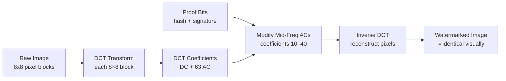

**DCT Embedding Math:**
```
For each 8×8 block B:
  [C_ij] = DCT(B)
  For bit b_k in payload:
    if b_k == 1: C_ij = 2*floor(C_ij/2) + 1  (make odd)
    if b_k == 0: C_ij = 2*floor(C_ij/2)      (make even)
  B' = IDCT([C_ij])
```

### 2. DWT (Discrete Wavelet Transform) Embedding

Wavelet-domain embedding provides **multi-resolution** proof markers — the watermark is present at every zoom level of the image (prevents crop-and-remove attacks).

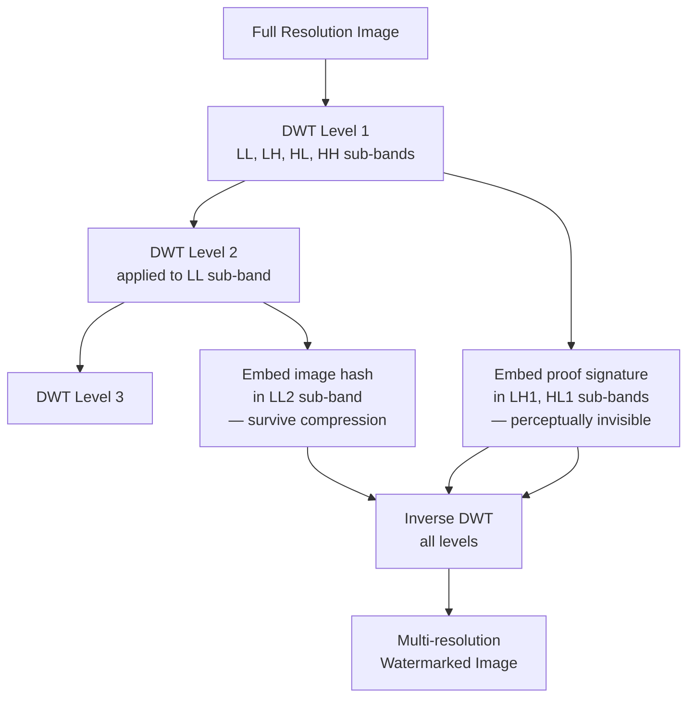

**DWT Sub-band Assignment:**

| Sub-band | Embedded Data | Attack Resistance |
|---|---|---|
| LL (low-low) | SHA-256 image hash | Compression, resizing |
| LH (low-high) | TEE attestation hash | Cropping attacks |
| HL (high-low) | ZK proof commitment | JPEG re-encode |
| HH (high-high) | Timestamp nonce | — (highest frequency, lossy) |

### 3. SuperPoint Pixel-Priority Encoding

**SuperPoint** (from Magic Leap / NAVER Labs) is a self-supervised deep learning model for homography-invariant keypoint detection. STAMPED uses SuperPoint's homographic adaptation to identify **the most semantically stable and information-rich pixels** in a scene, then encodes proof data preferentially at those coordinates.

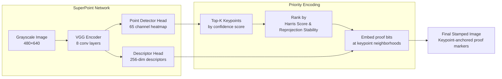

**Why Pixel Priority Matters:**

- Regular steganography embeds data uniformly or randomly → vulnerable to statistical steganalysis (RS analysis, χ² test)
- SuperPoint keypoints are **scene-semantically stable** — they correspond to corners, edges, and texture-rich regions that are invariant to rotation, scale, and viewpoint
- An attacker cannot remove these markers without destroying the perceptual quality of the image's most important features
- The verification algorithm re-runs SuperPoint on the claimed image and checks if proof bits are present at the predicted keypoint coordinates

```
Embedding capacity: ~50–200 bits per megapixel image
Detection rate: >98.7% after JPEG Q=75 re-compression
False positive rate: <0.01% on unmodified images
```

### Embedding Algorithm Comparison

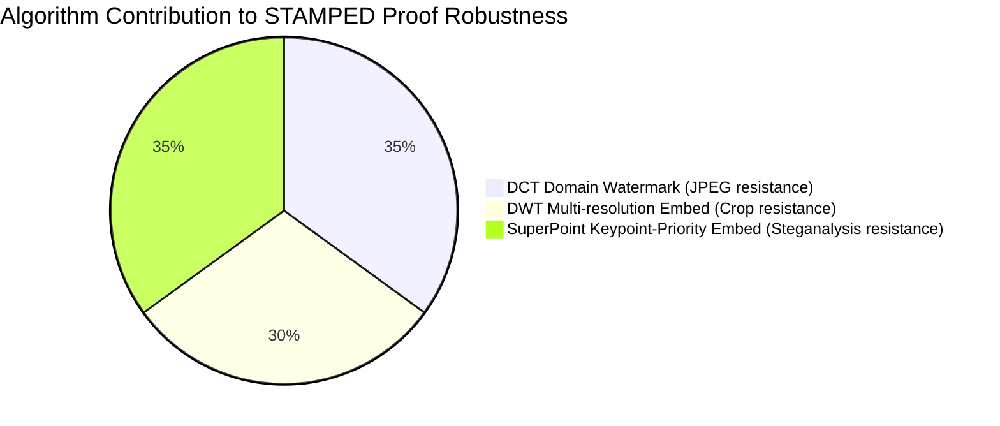

---

## ZK Proof Layer (Circom + Groth16 + Mopro)

### What is Proved?

STAMPED generates a **non-interactive zero-knowledge proof** that asserts:

> *"I know a (hash, timestamp, cameraId, nonce) such that `hash × timestamp × cameraId × nonce = proof` — without revealing hash, timestamp, cameraId, or nonce individually."*

This proves image authenticity without disclosing the raw sensor data or exact location.

### Circuit Architecture

**File: `zk-proofs/circuits/photo-verify.circom`**

```circom
pragma circom 2.0.0;

template ImageProof() {
    // PRIVATE inputs — never leave the device
    signal input hash;        // SHA-256 of raw image bytes
    signal input timestamp;   // Unix epoch at capture time
    signal input nonce;       // Random salt for replay-attack prevention
    signal input cameraId;    // Hardware camera identifier

    // Intermediate computation signals
    signal temp1;
    signal temp2;

    // Public OUTPUT — the on-chain proof commitment
    signal output proof;

    // Quadratic constraints (R1CS compatible)
    temp1 <== hash * timestamp;
    temp2 <== temp1 * cameraId;
    proof <== temp2 * nonce;
}

component main = ImageProof();
```

### Proof System: Groth16

STAMPED uses **Groth16** — the most efficient SNARK system for on-chain verification:

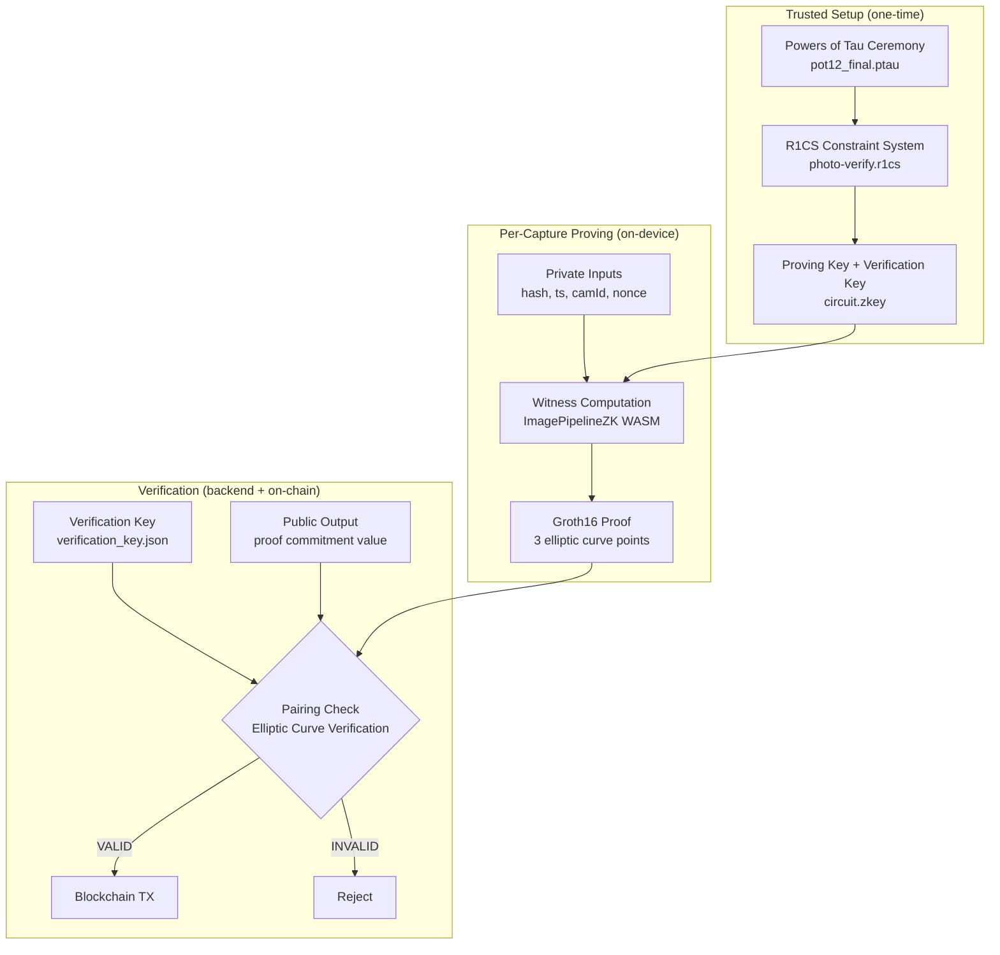

### Mopro FFI Integration

STAMPED uses **Mopro** — Mozilla's cross-platform ZK proof library — to run Circom circuits natively on Android and iOS via Rust FFI:

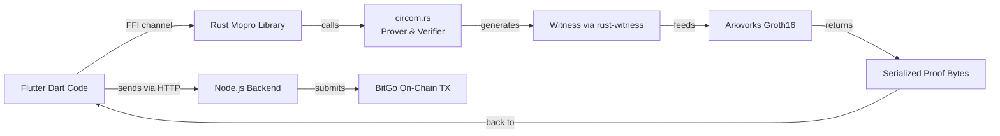

**Mopro Binding Chain:**

| Layer | File | Role |
|---|---|---|
| Android JNI | `MoproAndroidBindings/` | Exposes Rust ZK to Java/Kotlin |
| UniFFI | `lib.rs` (`mopro_ffi::app!()`) | Auto-generates FFI scaffolding |
| Circom Prover | `circom.rs` | Calls `generate_circom_proof()` / `verify_circom_proof()` |
| Witness Generator | `stubs.rs` + `rust_witness` | WASM witness → native binary |
| Trusted Setup | `circuit.zkey` | Bundled as Flutter asset |

---

## ☁️ Firebase & Firestore Schema

### Authentication

STAMPED uses **Firebase Authentication** with:
- Email/Password
- Google OAuth (via `google_sign_in`)
- Auth state persisted across sessions with `FlutterSecureStorage`

### Firestore Collections

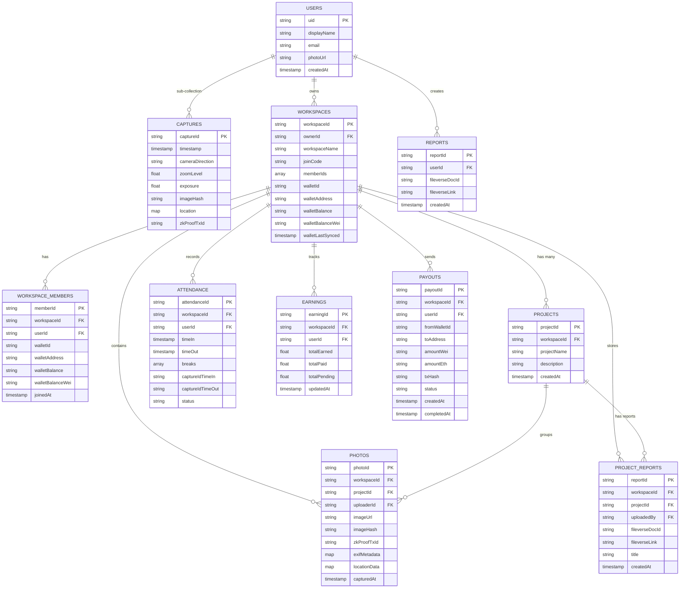

### Firestore Security Rules Summary

| Collection | Read | Write | Notes |
|---|---|---|---|
| `users/{uid}/**` | Any authenticated user | Owner only | Profile sub-collections |
| `captures/**` | Any authenticated user | Owner only | collectionGroup query allowed |
| `workspaces/{id}` | Member or limit query | Authenticated | Owner deletes |
| `projects/{id}` | Workspace member | Workspace owner | CRUD restricted |
| `photos/{id}` | Any authenticated | Member + self-upload | Owner or uploader can delete |
| `attendance/**` | Any authenticated | Any authenticated | Open for time-tracking writes |
| `earnings/{id}` | Any authenticated | **Backend Admin SDK only** | Client read-only |
| `payouts/{id}` | Any authenticated | **Backend Admin SDK only** | Client read-only |
| `workspace_members/{id}` | Any authenticated | **Backend Admin SDK only** | Client read-only |
| `project_reports/{id}` | Any authenticated | Uploader owns | reportId scoped |
| `reports/{id}` | Any authenticated | Any authenticated | Personal reports |

---

## BitGo TSS MPC Backend

### What is MPC TSS?

**Multi-Party Computation Threshold Signature Scheme (MPC TSS)** splits a private key into multiple shares held by different parties. A transaction requires `t-of-n` parties to cooperate, meaning no single party — including BitGo — ever holds the complete key.

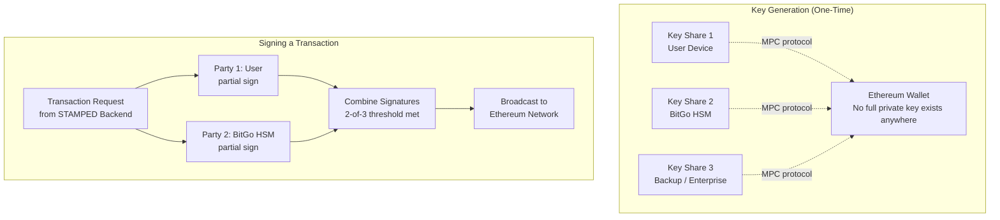

### Backend Service Map

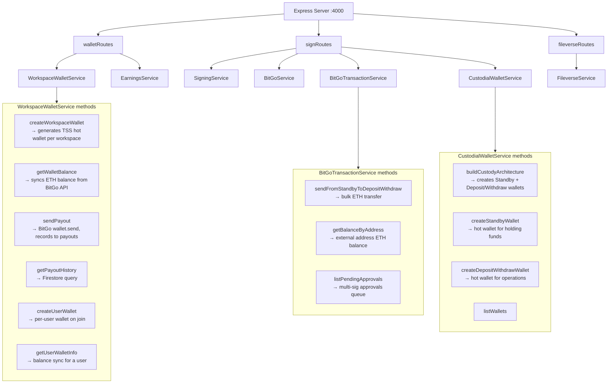

### Wallet Architecture

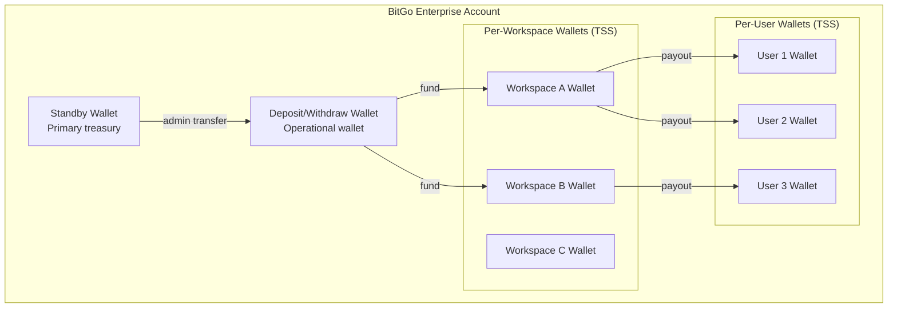

### API Endpoints

| Method | Route | Service | Description |
|---|---|---|---|
| `POST` | `/api/create-wallet` | WorkspaceWalletService | Create workspace TSS wallet |
| `GET` | `/api/wallet-balance/:wid` | WorkspaceWalletService | Get & sync ETH balance |
| `POST` | `/api/send-payout` | WorkspaceWalletService | Send ETH to member address |
| `GET` | `/api/payout-history/:wid` | WorkspaceWalletService | List payout records |
| `POST` | `/api/create-user-wallet` | WorkspaceWalletService | Create per-user wallet |
| `GET` | `/api/user-wallet/:wid/:uid` | WorkspaceWalletService | Get user wallet info |
| `POST` | `/api/calculate-earnings` | EarningsService | Calc earnings from attendance |
| `GET` | `/api/user-earnings/:wid/:uid` | EarningsService | Get user earnings |
| `POST` | `/api/sign` | SigningService | MPC sign operation |
| `POST` | `/api/fileverse/create` | FileverseService | Create dDoc |
| `GET` | `/api/fileverse/status/:id` | FileverseService | Get sync status |
| `PUT` | `/api/fileverse/update/:id` | FileverseService | Update dDoc content |
| `GET` | `/setup` | CustodialWalletService | Build custody architecture |
| `POST` | `/initiate-transaction` | BitGoTransactionService | Initiate ETH transfer |
| `GET` | `/pending-approvals` | BitGoTransactionService | List pending multi-sig |

---

## Flutter Frontend Architecture

### State Management: Provider Pattern

```mermaid
flowchart TD
    MAIN[main.dart\nMultiProvider root] --> CP[CameraProvider]
    MAIN --> AP[AttendanceProvider]
    MAIN --> FE[Features / Screens]

    subgraph CameraProvider_Details["CameraProvider (ChangeNotifier)"]
        CI[Camera Init\ninitCamera]
        LS[Location Stream\n_startLocationStream]
        CAP[addCapturedImage\nHash + EXIF + Firestore + Gallery]
        ZOOM[setSpecificLens\nphysical lens switching]
        FLASH[toggleFlash]
        PAU[pauseCamera / resumeCamera]
    end

    CP --> CameraProvider_Details

    subgraph Screens["Feature Screens"]
        CS[CameraScreen]
        GS[GalleryScreen\nZK Proof trigger + Firebase upload]
        WDS[WorkspaceDashboardScreen]
        PDS[PayoutDashboardScreen]
        ASS[AttendanceScreen]
        REP2[ReportMarkdownEditor\nFileverse report generation]
        RHS[ReportHistoryScreen]
        VS[VerificationScreen]
    end

    FE --> Screens
```

### Feature Modules

| Module | Screens | Key Functions |
|---|---|---|
| `auth` | Login, Register | Firebase Auth, Google Sign-In |
| `camera` | CameraScreen, GalleryScreen | Capture, EXIF inject, SHA-256 hash, ZK proof submit |
| `workspace` | WorkspaceDashboard, ProjectDetails, PayoutDashboard | Create/join workspace, project management, payout UI |
| `reports` | ReportMarkdownEditor, ReportHistory | Fileverse dDoc creation, markdown generation |
| `attendance` | AttendanceScreen | Time-in/out state machine, break tracking, date-wise view |
| `verification` | NetworkPhotoViewer | Blockchain TX viewer, proof replay |
| `location` | LocationPicker (removed) | GPS integration (now inline via Geolocator) |

### Camera Capture Flow

```mermaid
sequenceDiagram
    participant U as User
    participant CS as CameraScreen
    participant CP2 as CameraProvider
    participant FS2 as Firebase Storage
    participant FST2 as Firestore
    participant GS2 as GalleryScreen
    participant BE as BitGo Backend

    U->>CS: Tap shutter button
    CS->>CP2: takePicture()
    CP2->>CP2: CameraController.takePicture()
    CP2->>CP2: FlutterImageCompress JPEG Q95
    CP2->>CP2: SHA-256 jpegBytes imageHash
    CP2->>CP2: native_exif write hash to UserComment
    CP2->>CP2: write GPS data to ImageDescription
    CP2->>CP2: Gal.putImage device gallery
    CP2->>FST2: users/uid/captures/id.set metadata
    CP2-->>CS: File object returned
    CS->>GS2: Navigate to gallery
    GS2->>FS2: uploadBytes jpegBytes image URL
    GS2->>BE: POST /api/sign hash + metadata
    BE->>BE: Circom witness generate
    BE->>BE: Groth16 prove
    BE->>BE: BitGo wallet.send Holesky TX
    BE-->>GS2: txId, proofBytes
    GS2->>FST2: photos/id.update zkProofTxId
    GS2-->>U: Snackbar Proven on-chain txId
```

### Flutter Dependencies (pubspec.yaml)

| Package | Purpose | Version |
|---|---|---|
| `camera` | Device camera HAL access | ^0.11.2+1 |
| `geolocator` | Real-time GPS stream | ^14.0.2 |
| `geocoding` | Reverse geo lookup | ^4.0.0 |
| `native_exif` | Read/write EXIF metadata natively | ^0.7.0 |
| `crypto` | SHA-256 image hashing | ^3.0.7 |
| `pointycastle` | Elliptic curve crypto | ^4.0.0 |
| `flutter_image_compress` | JPEG encoding | ^2.3.0 |
| `gal` | Save to device gallery | ^2.3.2 |
| `firebase_core` | Firebase SDK | ^4.5.0 |
| `firebase_auth` | Authentication | ^6.2.0 |
| `cloud_firestore` | Realtime database | ^6.1.3 |
| `flutter_secure_storage` | Encrypted credential store | ^10.0.0 |
| `provider` | State management | ^6.1.5+1 |
| `flutter_markdown` | Render AI-generated reports | ^0.7.7+1 |
| `cached_network_image` | Efficient image loading | ^3.3.1 |
| `url_launcher` | Open blockchain explorer links | ^6.3.2 |

---

## Fileverse Decentralized Document Layer

### What is Fileverse?

[Fileverse](https://fileverse.io) is a **privacy-first, decentralized collaboration protocol** built on IPFS and Ethereum. STAMPED uses Fileverse **dDocs** (decentralized documents) to:

- Store complete forensic audit reports permanently
- Give clients/auditors a tamper-proof, shareable report link
- Anchor the report to the on-chain proof via document ID

### Fileverse Integration Architecture

```mermaid
sequenceDiagram
    participant Flutter2 as Flutter App
    participant BE2 as BitGo Backend :4000
    participant FVAPI as Fileverse Local API :8001
    participant IPFS2 as IPFS / Fileverse Network

    Flutter2->>BE2: POST /api/fileverse/create {title, content}
    BE2->>FVAPI: POST /api/ddocs?apiKey=xxx
    FVAPI->>IPFS2: Pin markdown content to IPFS
    IPFS2-->>FVAPI: CID + documentId
    FVAPI-->>BE2: {documentId, syncStatus: "pending"}
    BE2-->>Flutter2: {documentId}

    loop Poll until synced
        Flutter2->>BE2: GET /api/fileverse/status/{docId}
        BE2->>FVAPI: GET /api/ddocs/{docId}
        FVAPI-->>BE2: {syncStatus: "synced", link: "https://..."}
        BE2-->>Flutter2: synced
    end

    Flutter2->>Firestore: reports/{id}.set({fileverseDocId, fileverseLink})
    Flutter2-->>User: "Report Published" + share link
```

### dDoc Content Structure

Each Fileverse report generated by STAMPED contains:

```markdown
# STAMPED Forensic Report
**Workspace:** [name]  
**Project:** [name]  
**Generated:** [timestamp]

## Captured Images
| # | Capture ID | Location | Hash | ZK Proof TX |
|---|---|---|---|---|
| 1 | cap_abc123 | 28.6°N, 77.2°E | sha256:... | 0xabc... |

## Images


## Attestation Chain
- Device Integrity: MEETS_STRONG_INTEGRITY  
- ZK Proof: VALID (Groth16/Circom)  
- Blockchain TX: [view on Blockscout](https://...)  
- IPFS CID: Qm...
```

---

## Data & Proof Flow End-to-End

```mermaid
flowchart TB
    subgraph Device["User Device"]
        CAP2[Camera HAL captures raw YUV]
        TEE2[TrustZone TA hashes + signs]
        SHA[SHA-256 image hash]
        EXIF2[EXIF injection: hash + GPS]
        DCT2[DCT watermark embed]
        DWT2[DWT multi-res embed]
        SP[SuperPoint keypoint priority embed]
        ZKW[Circom witness generation]
        ZKP[Groth16 proof generation\ncircuit.zkey]
    end

    subgraph Upload["Upload Phase"]
        FSUP[Firebase Storage upload]
        FSMETA[Firestore metadata write]
        BEPOST[POST to BitGo Backend]
    end

    subgraph Prove["On-Chain Proof"]
        BITGOSIGN[BitGo MPC TSS sign]
        HOLSKY[Ethereum Holesky TX broadcast]
        TXID[txId returned]
    end

    subgraph Report["Report Phase"]
        MDG[Markdown report generated]
        FVCREATE[Fileverse dDoc created]
        FVSYNC[IPFS sync → permanent link]
        FSREPORT[Firestore report record]
    end

    subgraph Verify2["Verification Phase"]
        ANYONE[Any third party]
        PULLFB[Pull metadata from Firestore]
        RECALC[Re-hash + re-verify ZK proof]
        CHECKCHAIN[Check blockchain TX]
        CHECKSTEG[Check steganographic markers]
        VERDICT{Authentic?}
    end

    CAP2 --> TEE2 --> SHA --> EXIF2
    EXIF2 --> DCT2 --> DWT2 --> SP
    SP --> ZKW --> ZKP
    ZKP --> BEPOST
    SP --> FSUP
    SHA --> FSMETA

    BEPOST --> BITGOSIGN --> HOLSKY --> TXID
    TXID --> FSMETA
    HOLSKY --> MDG --> FVCREATE --> FVSYNC --> FSREPORT

    ANYONE --> PULLFB --> RECALC --> CHECKCHAIN --> CHECKSTEG --> VERDICT
    VERDICT -->|YES| TRUST[TRUSTED]
    VERDICT -->|NO| REJECT2[REJECTED]
```

---

## Market Components & Competitive Landscape

### Market Verticals STAMPED Serves

```mermaid
pie title Revenue Opportunity by Vertical (5-Year Projection)
    "Insurance Claims Processing" : 28
    "Construction Site Monitoring" : 22
    "Field Workforce Compliance" : 18
    "Supply Chain Audit" : 14
    "Legal & Court Evidence" : 10
    "Journalism & Media Authenticity" : 5
    "Government & Defense" : 3
```

### Competitive Landscape

| Company | Approach | Weakness vs STAMPED |
|---|---|---|
| **Truepic** | Server-side verification, proprietary SDK | Centralized — trust the company, not the math |
| **Numbers Protocol** | Blockchain image registry, IPFS storage | No ZK proof, no TEE attestation, no steganography |
| **Amber Authenticate** | Camera app + blockchain timestamp | No on-device hardware attestation, no ZK layer |
| **Adobe Content Authenticity** | C2PA standard, metadata signing | Stripped by social media platforms, no on-chain anchor |
| **Starling Lab** | Academic research, manual verification | Not scalable, no enterprise workflow |
| **STAMPED** | Full 7-layer: TEE + ZK + Steg + On-chain + P2P docs | — |

```mermaid
quadrantChart
    title Verification Completeness vs. Enterprise Usability
    x-axis Low Enterprise Usability --> High Enterprise Usability
    y-axis Low Verification Completeness --> High Verification Completeness
    quadrant-1 Sweet spot
    quadrant-2 Academic / Research
    quadrant-3 Consumer toy
    quadrant-4 Enterprise but shallow
    Truepic: [0.65, 0.45]
    Numbers Protocol: [0.40, 0.55]
    Amber Authenticate: [0.35, 0.40]
    Adobe CAI: [0.72, 0.50]
    Starling Lab: [0.20, 0.65]
    STAMPED: [0.80, 0.92]
```

### Business Model

```mermaid
pie title STAMPED Revenue Model Components
    "SaaS Workspace Subscriptions" : 45
    "Per-Proof Transaction Fees (ETH)" : 20
    "Enterprise API Licensing" : 18
    "Legal Evidence Vault (Premium)" : 10
    "Insurance Partner Integrations" : 7
```

### Go-to-Market Strategy

```mermaid
flowchart LR
    subgraph Phase1["Phase 1 — 0-12 months"]
        P1A[Construction & Real Estate\nField documentation]
        P1B[Insurance Adjusters\nClaims photo verification]
    end

    subgraph Phase2["Phase 2 — 12-24 months"]
        P2A[Supply Chain & Logistics\nDelivery & condition proof]
        P2B[Remote Workforce\nAttendance & task verification]
    end

    subgraph Phase3["Phase 3 — 24-48 months"]
        P3A[Legal & Court Systems\nEvidence chain of custody]
        P3B[Government & Defense\nClassified field documentation]
        P3C[Media & Journalism\nDeepfake-proof newswire]
    end

    Phase1 --> Phase2 --> Phase3
```

---

## API Reference

### Backend Base URL

```
http://localhost:4000   (development)
https://api.stamped.io  (production)
```

### Wallet Endpoints

```http
POST /api/create-wallet
Content-Type: application/json

{
  "workspaceId": "ws_abc123",
  "workspaceName": "Site Alpha"
}

Response 200:
{
  "walletId": "bitgo_wallet_id",
  "walletAddress": "0x...",
  "walletBalance": "0",
  "walletBalanceWei": "0"
}
```

```http
POST /api/send-payout
Content-Type: application/json

{
  "workspaceId": "ws_abc123",
  "userId": "firebase_uid",
  "toAddress": "0xRecipient...",
  "amountWei": "1000000000000000"
}

Response 200:
{
  "txHash": "0x...",
  "status": "completed",
  "newBalanceEth": "0.099",
  "newBalanceWei": "99000000000000000"
}
```

### Fileverse Endpoints

```http
POST /api/fileverse/create
Content-Type: application/json

{
  "title": "Site Alpha Report — March 2026",
  "content": "# Report\n..."
}

Response 200:
{
  "documentId": "ddoc_xyz",
  "link": "https://fileverse.io/..."
}
```

---

## Setup & Installation

### Prerequisites

| Tool | Version | Purpose |
|---|---|---|
| Flutter SDK | ≥ 3.8.0 | Mobile app |
| Dart SDK | ≥ 3.8.0 | Flutter language |
| Node.js | ≥ 18 LTS | BitGo backend |
| Rust + Cargo | ≥ 1.75 | ZK proof engine |
| Circom | ≥ 2.0 | Circuit compilation |
| snarkjs | ≥ 0.7 | Trusted setup |

### 1. Clone & Environment

```bash
git clone https://github.com/your-org/stamped.git
cd stamped

# Flutter env
cp .env.example .env
# Fill: FIREBASE_*, BACKEND_URL

# Backend env
cd Stamped-BItgo-backend
cp .env.example .env
# Fill: BITGO_ACCESS_TOKEN, BITGO_ENTERPRISE_ID, 
#       FILEVERSE_API_KEY, FILEVERSE_SERVER_URL
```

### 2. Flutter App

```bash
cd stamped
flutter pub get
flutter run
```

### 3. BitGo Backend

```bash
cd Stamped-BItgo-backend
npm install
npm run dev    # ts-node src/server.ts on :4000
```

### 4. Fileverse Local API

```bash
# Run Fileverse local API as per fileverse_docs/
# Binds to :8001
```

### 5. ZK Circuit (one-time setup)

```bash
cd zk-proofs
# If re-building circuit:
circom circuits/photo-verify.circom --r1cs --wasm --sym
snarkjs groth16 setup circuits/photo-verify.r1cs circuits/pot12_final.ptau circuits/circuit.zkey
snarkjs zkey export verificationkey circuits/circuit.zkey circuits/verification_key.json

# Build Rust ZK library
cargo build --release
```

### 6. Firebase Setup

```bash
firebase login
firebase use --add   # select your project
firebase deploy --only firestore:rules
```

### Architecture Ports

| Service | Port | Protocol |
|---|---|---|
| Flutter Dev Server | N/A | (runs on device) |
| BitGo Backend | 4000 | HTTP/REST |
| Fileverse Local API | 8001 | HTTP/REST |
| Firebase (cloud) | 443 | HTTPS |
| Ethereum Holesky RPC | 443 | HTTPS via BitGo |

---

## License

MIT License — See [LICENSE](LICENSE) for details.

---

## Contributing

1. Fork the repository
2. Create your feature branch (`git checkout -b feature/AmazingFeature`)
3. Commit your changes (`git commit -m 'feat: Add AmazingFeature'`)
4. Push to the branch (`git push origin feature/AmazingFeature`)
5. Open a Pull Request

---

<div align="center">

**Built by Stamped!!**

*Proving truth, one pixel at a time.*

[](https://flutter.dev)
[](https://bitgo.com)
[](https://github.com/iden3/circom)
[](https://fileverse.io)

</div>
